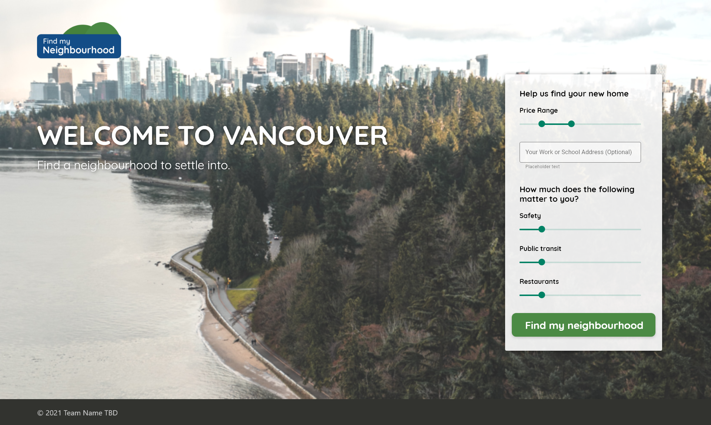
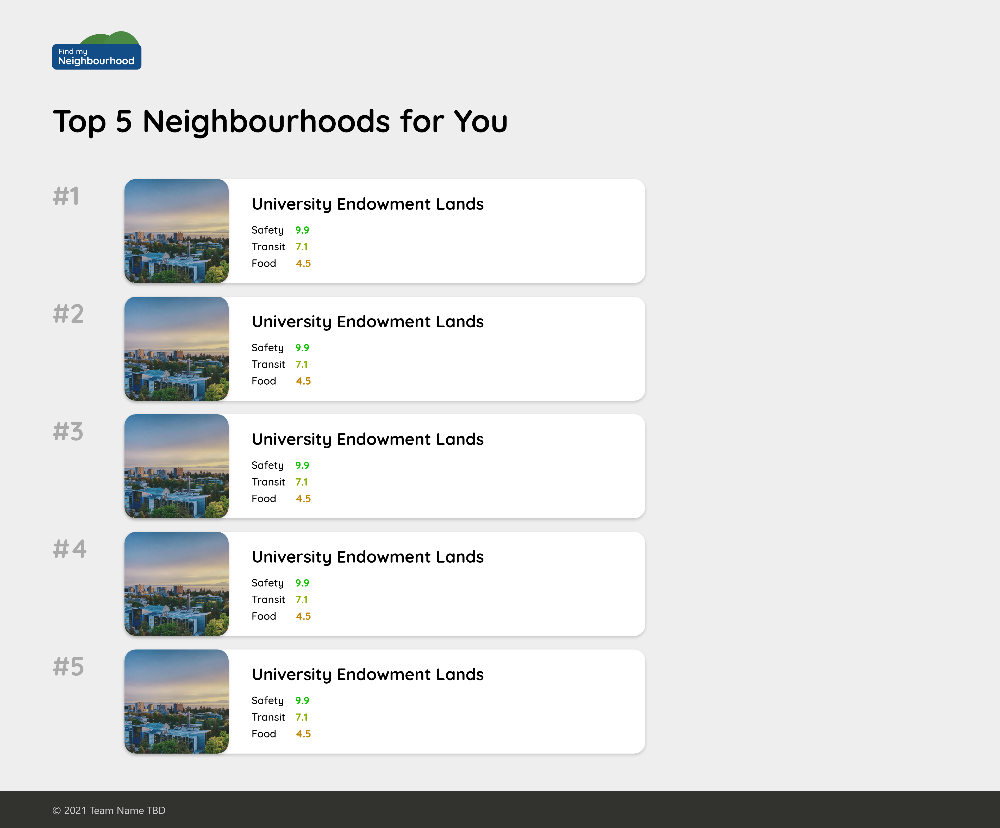

# Find My Neighbourhood

### Table of Contents

- [Description](#description)
- [How To Use](#how-to-use)

- [My Information](#My-Information)

---

## Description

When you move to Vancouver, most of the information is qualitative rather than quantitative. To fix this problem, users can use our web app to know the ideal place to live based on their criteria.

#### Technologies

- React.js
- Node.js
- PostgreSQL
- Express.js
- HTML5
- CSS
- Git
- Various APIs

[Back To The Top](#Portfolio)

---

## My Information

 

[Back To The Top](#4Hour-Fruit-Shop-Website-Coding-Challenge)
